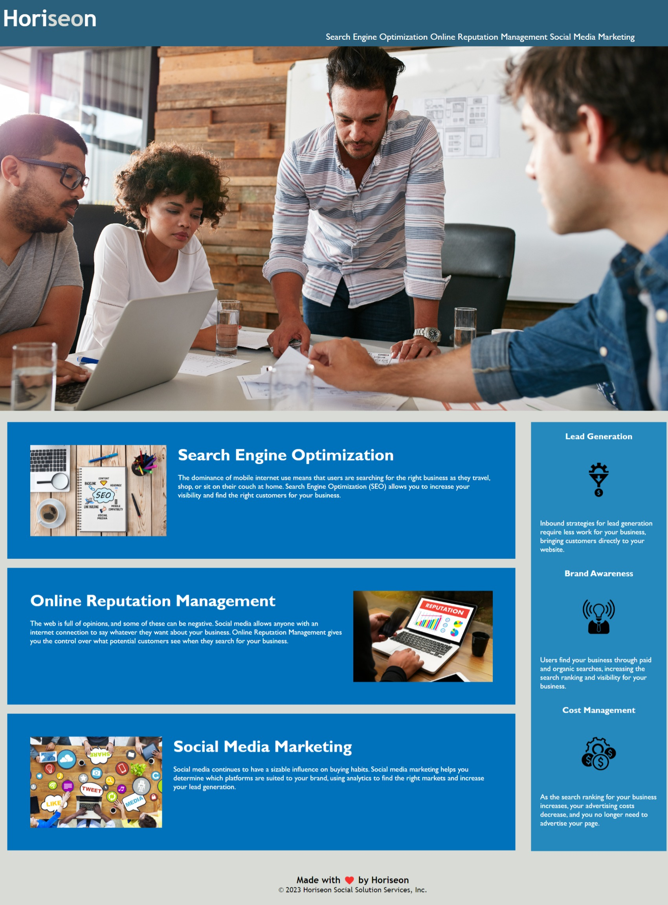

# Challenge-1-UTA

Challenge 1 repository for UT Austin Fullstack Developer Bootcamp.

## Description

This project was a practice with the purpose of making websites more available for users. With the use of semantic HTML and clean CSS, this website has been refactored into a more efficient and accesible site, especially for those who are in need of assist. 

## User Story

AS A marketing agency
I WANT a codebase that follows accessibility standards
SO THAT our own site is optimized for search engines.

## Installation

N/A.

## Usage

This website is by a marketing agency called Horiseon, which offers many different services, such as, Search Engine Optimization, Online Reputation Management, and Social Media Marketing.

## License

Please refer to the license in the repository.